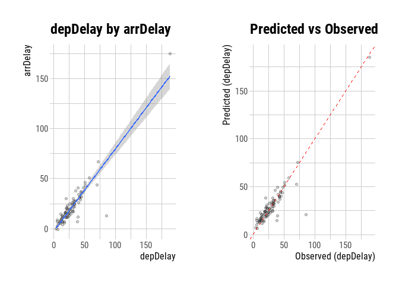
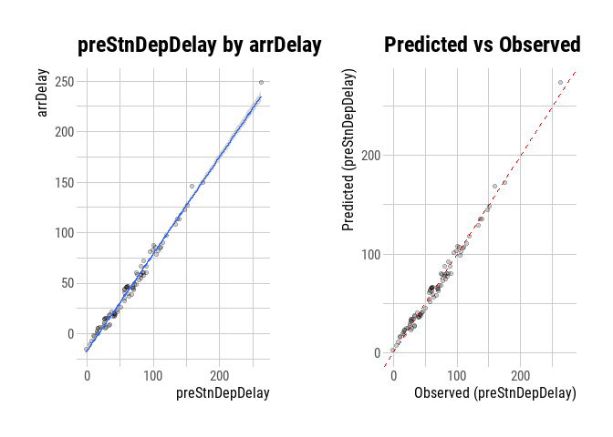

Final Project
================
Junhee Lee
2022-06-13

### Introduction

-   The purpose of this study is to find the subway station where the
    delay of the subway line is majorly occured

-   To solve this problem, the data below has been used

    -   Operated subway data
    -   Scheduled subway data

-   The time and space considered for this study is written as below

    -   Target space: Seoul metro line 9 bound to VHS Medical Center
        (Gimpo Int’l Airport → VHS Medical Center)
    -   Target time: 03/08/2021 \~ 03/12/2021, morning peak time
        (07:00\~10:00)

-   There are two types of subway exist on line 9: local train & express
    train

    -   Local train: stops at all station
    -   Express train: stops only at some stations
    -   In this study, only express train is considered

<figure>

<figcaption aria-hidden="true">Image from theissaclee.com</figcaption>
</figure>

### Data Analysis

-   Considered two type of delay time: arrival delay & departure delay

    -   Arrival delay: difference between operated subway arrival time
        and scheduled subway arrival time
    -   Departure delay: difference between operated subway departure
        time and scheduled subway departure time
    -   In this study, information of arrival delay and departure delay
        from terminal stations have been excluded

-   The distribution of arrival delay time and departure delay time of
    each station is shown as below
    <!-- --><!-- -->

-   Convert delay time by subtract the departure delay time of the
    origin of the train (X4102, Gimpo Int’l Ariport)
    <!-- --><!-- -->

-   The delay time increases at stations whose ID is between X4113 and
    X4120

-   The delay time decreases at stations whose ID is between X4123 and
    X4130

### Analysis of Data Correlation

-   Correlation of arrival delay and departure delay from current
    station and previous station
    -   Arrival delay and departure delay has high correlation
    -   Compared with previous station, arrival delay from current
        station and departure delay from previous station has the
        highest correlation

<!-- --><!-- --><!-- -->

-   Correlation for each station
    -   In many station, correlation of departure delay from previous
        station and arrival delay from current station is higher than
        correlation of departure delay and arrival delay from current
        station
    -   However, at the section between X4110 and X4113, X4113 and
        X4115, X4120 and X4123, X4130 and X4133, departure delay from
        previous station and arrival delay from current station does not
        shown the correlation better than departure delay and arrival
        delay from current station

<!-- -->

    ## [1] "Previous Station ID: X4102"
    ## [1] "Current Station ID: X4105"

<!-- --><!-- -->

    ## [1] "Previous Station ID: X4105"
    ## [1] "Current Station ID: X4107"

<!-- --><!-- -->

    ## [1] "Previous Station ID: X4107"
    ## [1] "Current Station ID: X4110"

<!-- --><!-- -->

    ## [1] "Previous Station ID: X4110"
    ## [1] "Current Station ID: X4113"

<!-- --><!-- -->

    ## [1] "Previous Station ID: X4113"
    ## [1] "Current Station ID: X4115"

<!-- --><!-- -->

    ## [1] "Previous Station ID: X4115"
    ## [1] "Current Station ID: X4117"

<!-- --><!-- -->

    ## [1] "Previous Station ID: X4117"
    ## [1] "Current Station ID: X4120"

<!-- --><!-- -->

    ## [1] "Previous Station ID: X4120"
    ## [1] "Current Station ID: X4123"

<!-- --><!-- -->

    ## [1] "Previous Station ID: X4123"
    ## [1] "Current Station ID: X4125"

<!-- --><!-- -->

    ## [1] "Previous Station ID: X4125"
    ## [1] "Current Station ID: X4127"

<!-- --><!-- -->

    ## [1] "Previous Station ID: X4127"
    ## [1] "Current Station ID: X4129"

<!-- --><!-- -->

    ## [1] "Previous Station ID: X4129"
    ## [1] "Current Station ID: X4130"

<!-- --><!-- -->

    ## [1] "Previous Station ID: X4130"
    ## [1] "Current Station ID: X4133"

<!-- --><!-- -->

    ## [1] "Previous Station ID: X4133"
    ## [1] "Current Station ID: X4136"

<!-- --><!-- -->
